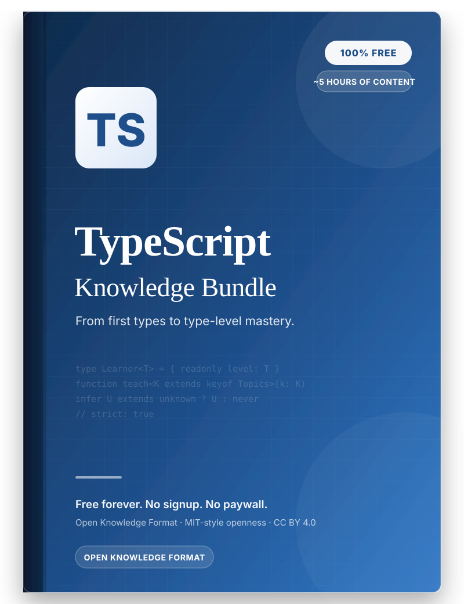

  

# TypeScript Knowledge Bundle

**Learn TypeScript properly. Completely free. Forever.**
A structured path from your first `.ts` file to type-level mastery — no
signup, no paywall, no catch.

---

## Why this exists

Most TypeScript material is either a 400-page reference nobody reads
cover-to-cover, or a paid course locked behind a subscription. This bundle is
neither. It is free, structured knowledge you can read straight through,
search, fork, or feed into your own tools — because a type system this good
shouldn't be a barrier to entry.

- **Free, no strings attached.** Every topic, every example, forever. Star it,
  clone it, print it — nothing here is metered.
- **Structured like a real curriculum.** Topics build on each other in a
  deliberate order, not a wiki dump. Start at
  [Introduction](knowledge/introduction/index.md) and follow the path.
- **Machine-readable.** Authored in Google's
  [Open Knowledge Format](https://github.com/GoogleCloudPlatform/knowledge-catalog/blob/main/okf/SPEC.md),
  so the same content that reads well on GitHub can be indexed, searched, and
  consumed by tools and AI assistants alike.
- **Verifiable.** Code examples live as real `.ts` files under
  `assets/code-snippets/` and are type-checked in CI — if TypeScript changes,
  the examples break loudly instead of silently rotting.

### Who it is for

- **Beginners** coming from JavaScript who need a solid mental model of the
  type system.
- **Working developers** who use TypeScript daily but want to actually
  understand generics, narrowing, and module patterns.
- **Advanced engineers** aiming to master type-level programming, declaration
  files, and compiler configuration.

## Start learning

Begin with [**Introduction**](knowledge/introduction/index.md):

| Topic | What you'll learn |
| --- | --- |
| [What Is TypeScript?](knowledge/introduction/what-is-typescript.md) | What TypeScript is, how it relates to JavaScript, and why it exists. |
| [Your First TypeScript](knowledge/introduction/your-first-typescript.md) | Set up a minimal project and run your first `.ts` file. |

More topics are added regularly — see
[`knowledge/index.md`](knowledge/index.md) for the full, current table of
contents and [`knowledge/log.md`](knowledge/log.md) for the update history.

## How the bundle is organized

This repository is an
[Open Knowledge Format (OKF)](https://github.com/GoogleCloudPlatform/knowledge-catalog/blob/main/okf/SPEC.md)
bundle rooted at [`knowledge/`](knowledge/index.md).

| Path | Purpose |
| --- | --- |
| `knowledge/index.md` | Reserved bundle-root index — the table of contents |
| `knowledge/log.md` | Reserved changelog — chronological update history |
| `knowledge/<topic>/index.md` | Reserved per-topic index, e.g. `knowledge/introduction/index.md` |
| `knowledge/<topic>/*.md` | Individual concepts, each with OKF frontmatter (`type`, `title`, `description`, `tags`) |
| `assets/images/` | Diagrams and cover art referenced from the knowledge units |
| `assets/code-snippets/` | Real `.ts` files embedded in the knowledge units, type-checked in CI |
| `templates/` | Frontmatter skeletons for new concepts, guides, references, and exercises |

## Contributing

See [CONTRIBUTING.md](CONTRIBUTING.md) for the frontmatter schema, naming
conventions, and how to add a topic, concept, snippet, or image.

## License

Content is licensed under [CC BY 4.0](LICENSE). Code snippets are released
under CC0 and may be copied into any project without attribution.
